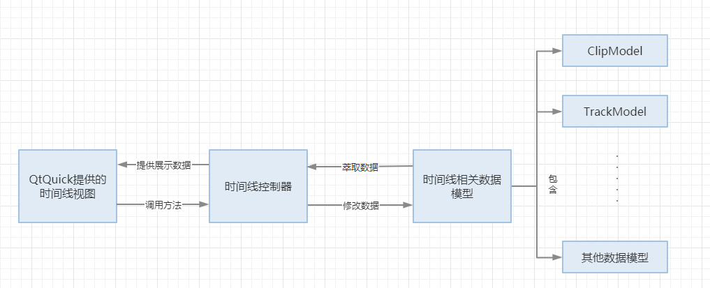

# 软件架构

*本文档自顶向下地描述了`SmartIP-Editor`软件的架构*

* 自顶向下的架构描述
  * MLT 等依赖
  * MVC 模式
  * GUI元素与其用途 
* 使用 Doxygen 生成文档

## 概述

### MLT 等依赖

`SmartIP-Editor`使用了许多第三方库，其中最重要的组件是作为承担视频编辑功能核心的`MLT`库。其中的melt渲染器进程将剪辑素材和剪辑上应用的效果组织至轨道和时间线，并将数据传入剪辑软件中在视频区域内将内容展示渲染。

软件使用像`frei0r`、`ladspa`、`movit`这样的第三方库来提供各种效果，主要包括两种大类:<Filters 过滤器>用于对单个剪辑素材添加效果，如位移、调色等<Transitions 转场>用于设定对两个轨道或剪辑素材进行混合以及混合模式，如叠加、相减、求最大值、溶解等。 在MLT的官方文档**Plugins (Services)**项下可以查阅这些组件的详细信息[MLT Documentation](https://www.mltframework.org/docs/)

```
        ┌──────────────┐   
        │SmartIP-Editor├─────┐
        └──────────┬───┘     │
    渲染项目        │         │ 参数配置
 解码音/视频        │         │ 设置素材的效果
                   │         │        
              ┌────┴───┐     │        
              │  MLT   ├─────┤             
              └────────┘     │ 音/视频效果来源集合
                             ├───────┬──────┬─────────┐
                          ┌──┴───┐┌──┴───┐┌─┴─┐┌──────┴──────┐
                          │frei0r││LADSPA││SoX││libsamplerate│
                          └──────┘└──────┘└───┘└─────────────┘
```

### MVC模式

本项目中大量使用了MVC架构模型来编写组件，一个典型的例子如下

#### 时间线模块结构 (timeline2)

├─Model ...
│  │  时间线功能函数
│  │  时间线单个项目数据模型
│  │  时间线数据模型
│          ......
└─view ...
    │  时间线控制器 (Controller)
    │  ......
    ├─qml
	│  时间线视图 (View)
	│  ......

大致协作图：



此类模块主要的复杂性在于model的种类较多，且存在嵌套关系，需要分析视图层级并找到与其对应的数据模型才能直观地对代码与功能进行对应

### GUI元素及用途

这里提到的`GUI元素`主要指在项目中出现的各类可操作的控制器、展示用的装饰、进行直观数据交互的部件(**如视频播放器**)等，本部分主要使用图片注解的方式标注Kdenlive和SmartIP-Editor重要界面中出现的各个`GUI元素`

## 使用 Doxygen 生成文档

[预生成的初版文档页面](https://lcbhsstudent.github.io/smartip-editor-doc/) 主要内容位于`类`和`文件`tag下

本项目使用`Doxygen`自动生成`bootstrap`风格的文档`html`，相关操作封装如下，具体请查询`Doxygen`官方文档

```bash
# 适用的doxygen版本为 小于 '1.8.12' 
# 如果没安装 doxygen 或处于windows环境下，请使用docker
## 拉取最新的doxygen镜像
docker pull hrektts/doxygen
## 在项目目录内执行此命令，输出目录为项目目录下的./html/ ./latex/ 文件夹
docker run -it --rm -v "$(pwd):/data" hrektts/doxygen:latest doxygen Doxyfile
## 若无法执行，可以进入容器更换doxygen版本，也可以使用wsl虚拟机安装doxygen，进入项目目录后执行
### doxygen Doxyfile
```

`Doxyfile` 中常用的修改参数如下

```bash
# 版本号
PROJECT_NUMBER         =
# 项目名
PROJECT_NAME           = "SmartIP-Editor"
# 解压全部类方法、继承关系
EXTRACT_ALL   = YES
# 使用UML类图外观
UML_LOOK      = YES
# 递归遍历路径搜索源码
RECURSIVE     = YES
# 输入源码根路径
INPUT         = src
```

